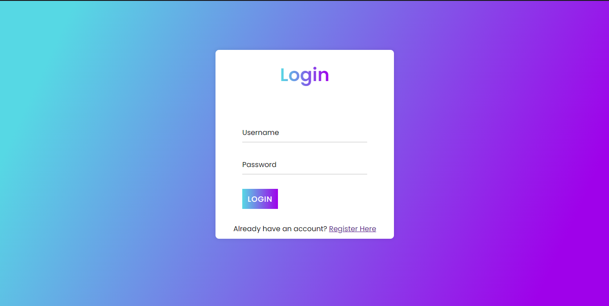
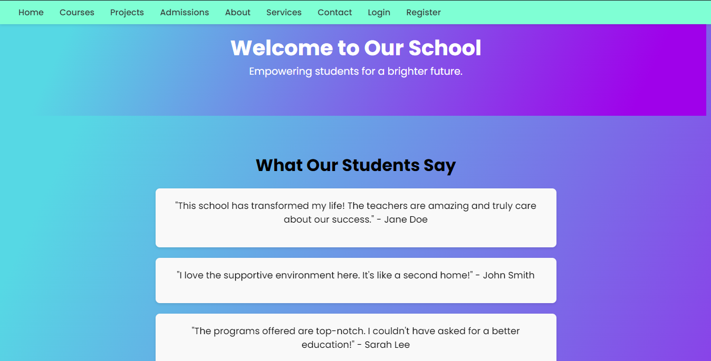

# School Website

## Description
This project is a responsive web application designed for a school, featuring a registration form and a homepage that provides information about the school, its courses, admissions, projects, and services.

## Table of Contents
- [Features](#features)
- [Application Domain](#application-domain)
- [Pages Overview](#pages-overview)
  - [Home Page](#home-page)
  - [Registration Page](#registration-page)
  - [Courses Page](#courses-page)
  - [Projects Page](#projects-page)
  - [Admissions Page](#admissions-page)
  - [About Page](#about-page)
  - [Services Page](#services-page)
  - [Contact Page](#contact-page)
- [Technologies Used](#technologies-used)
- [Installation](#installation)
- [Screenshots](#screenshots)
- [License](#license)

## Features
- User-friendly registration form
- Informative homepage with testimonials
- Detailed pages for courses, projects, and services
- Responsive design for mobile and desktop

## Application Domain
This application targets educational institutions looking to enhance their online presence and streamline student registration and information dissemination.

## Pages Overview

### Registration Page
This page allows users to create an account by providing:
- **First and Last Name**: Required fields for identification.
- **Username**: A unique identifier for the user.
- **Email**: For communication and verification.
- **Password & Confirm Password**: For account security.
- Validation messages to ensure accurate data entry.

### Login Page
This page allows users to  login to their account by providing:
- **Username**: A unique identifier for the user.

- **Password & Confirm Password**: For account security.
- Validation messages to ensure accurate data entry.

### Home Page
The home page serves as the welcome interface for prospective students, showcasing:
- **Hero Section**: A welcoming message emphasizing the school's mission.
- **Testimonials**: Quotes from students about their experiences.
- **Courses and Projects**: Brief descriptions of available courses and ongoing student projects.
- **Admissions Info**: Details on how to apply and become part of the school community.
- **Call to Action**: Encourages users to register.

### Courses Page
Displays a list of courses offered by the school, including:
- **Course Descriptions**: Brief overviews of each course's content.
- **Links to Read More**: Directs users to detailed course information.

### Projects Page
Highlights student projects that apply learning in real-world contexts, featuring:
- **Project Summaries**: Descriptions of community service initiatives and tech innovations.
- **Links to Read More**: Additional information on each project.

### Admissions Page
Provides details on the admissions process, including:
- **Application Instructions**: Steps to apply for enrollment.
- **Important Dates**: Deadlines and important milestones in the admissions cycle.

### About Page
Describes the school's mission, vision, and values, including:
- **History**: A brief background of the institution.
- **Goals**: Educational objectives and community engagement.

### Services Page
Outlines additional services provided to students, such as:
- **Counseling and Tutoring**: Support resources available.
- **Extracurricular Activities**: Opportunities for students outside the classroom.

### Contact Page
Contains contact information for the school, including:
- **Address**: Physical location of the institution.
- **Phone and Email**: Ways to get in touch with administrative staff.

## Technologies Used
- HTML5
- CSS3 (with Flexbox for layout)
- JavaScript (for form validation)

## Functionality

## Video to the functionality of the entire site.
[Watch Video  here](https://youtu.be/P_L8QHdIVmo)